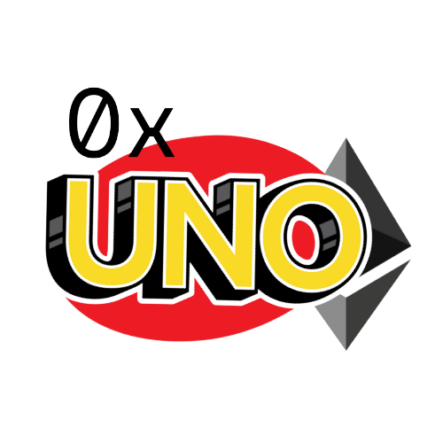
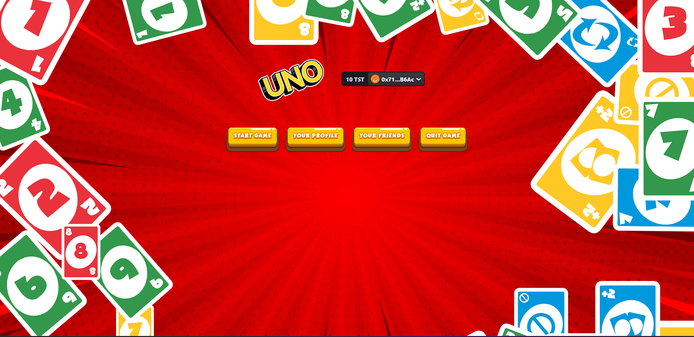
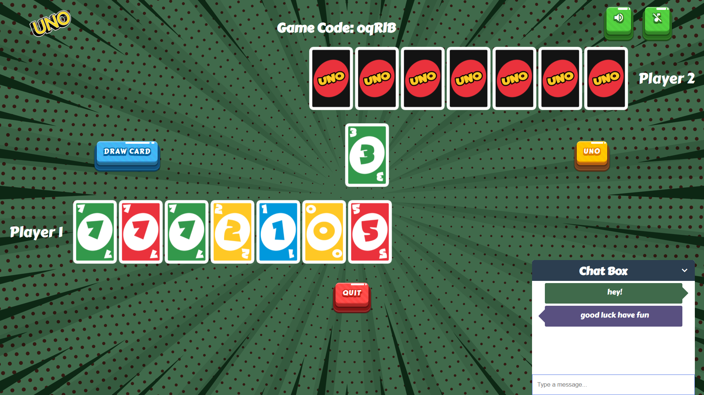
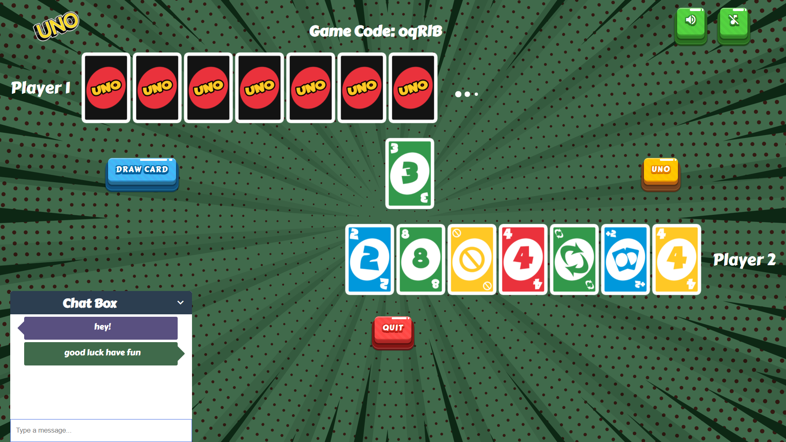
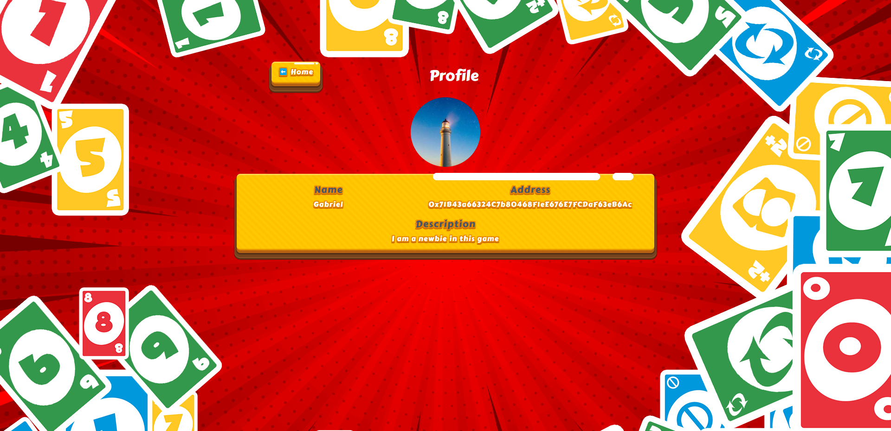
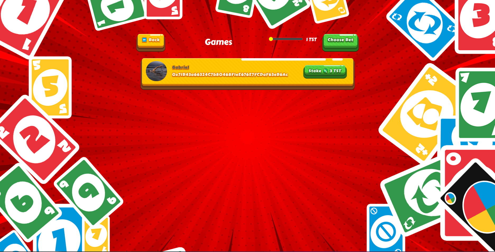
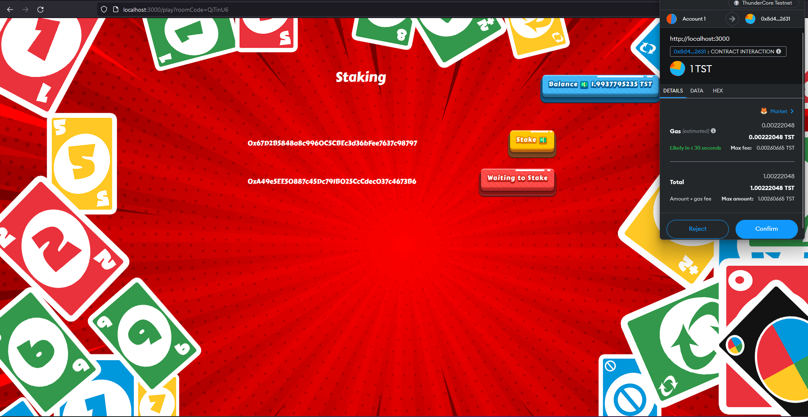
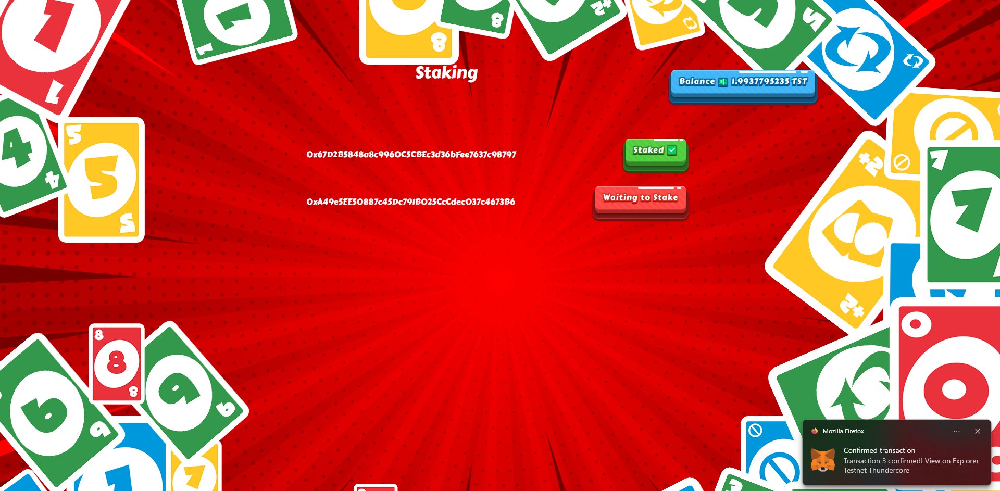

<h1 align="center">Zeus</h1>
<h2 align="center">Two player online game of UNO</h2>
<h2 align="center">Powered by ThunderCore Blockchain</h2>

## 🤔 What is UNO?

UNO is the classic and beloved card game that’s easy to pick up and impossible to put down! Players take turns matching a card in their hand with the current card shown on top of the deck either by color or number. Special action cards deliver game-changing moments as they each perform a function to help you defeat your opponents. These include skips, reverses, draw twos, color-changing wild and draw four wild cards.

## ⚠️ Game Rules

Read the complete rules of UNO [here](https://www.unorules.com/).

## 🎮 Screenshots

## Inspiration

UNO is a very popular game and my main motive towards building this project is to onboard more web2 users to web3 through gaming. UNO being a very fun game when played in groups , I wanted to take up the challenge to play this game remotely with a random person in a trust-free manner.

## What it does

The dApp allows users to create profiles and create games if they have enough TST tokens to stake. Once a player creates a game, another player can offer to play with him. If the other player accepts the offer, a room code is assigned and both players are required to stake the decided amount. Once both the players stake their TST tokens in the smart contract, the game begins. The cards are shuffled using ThunderCore's Random Number Generator. And the winner of the game is rewarded with TST tokens by the smart contract.

## How we built it

I built the frontend with React+TailwindCSS. My backend architecture consists of socket.io for multiplayer game play, chat messaging and match initialization. New games created are stored in a Postgresql database and the backend server is built with react for both the database and socket.io. I deployed my smart contract which handles the staking and winner rewarding mechanism in ThunderCore Testnet.

## Challenges we ran into

I ran into a lot of challenges with Socket.io since it was not working most of the time and failed to connect with the server causing a lot of time wasted into fixing it. ThunderCore was amazing and since it was EVM compatible I found no problem with integrating with my application.

## Accomplishments that we're proud of

I am proud of building my application which is fully functional. Even though some parts might break in my dApp, it is a successful prototype that functions the entire workflow without any issues and I'm proud of that accomplishment.

## What's next for Zeus

Looking foward to add fiat onramping to stake tokens and play the game so that I could onboard more web2 users to this game. Also the UI / UX needs to fine tuned to make it production ready.
